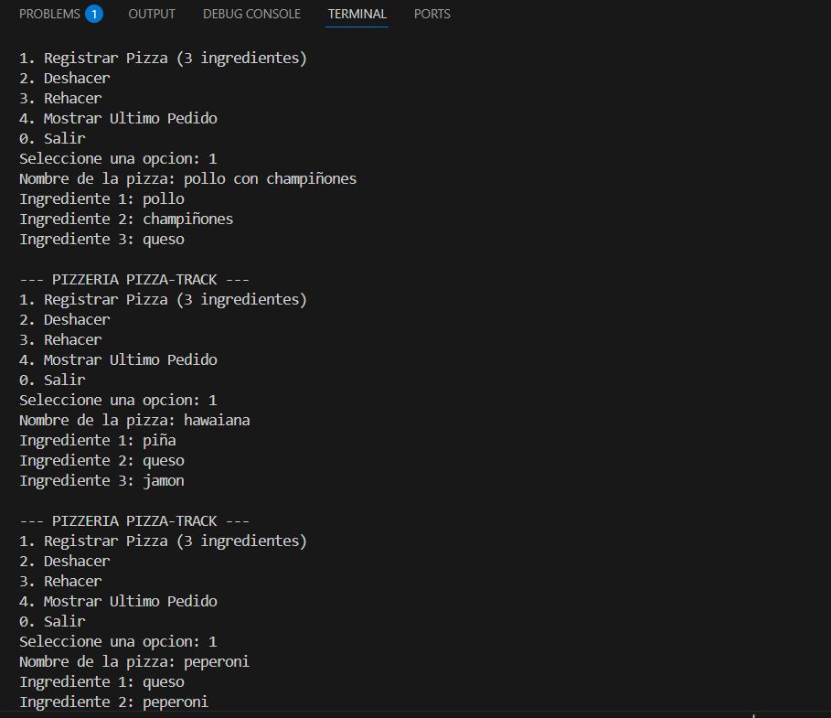
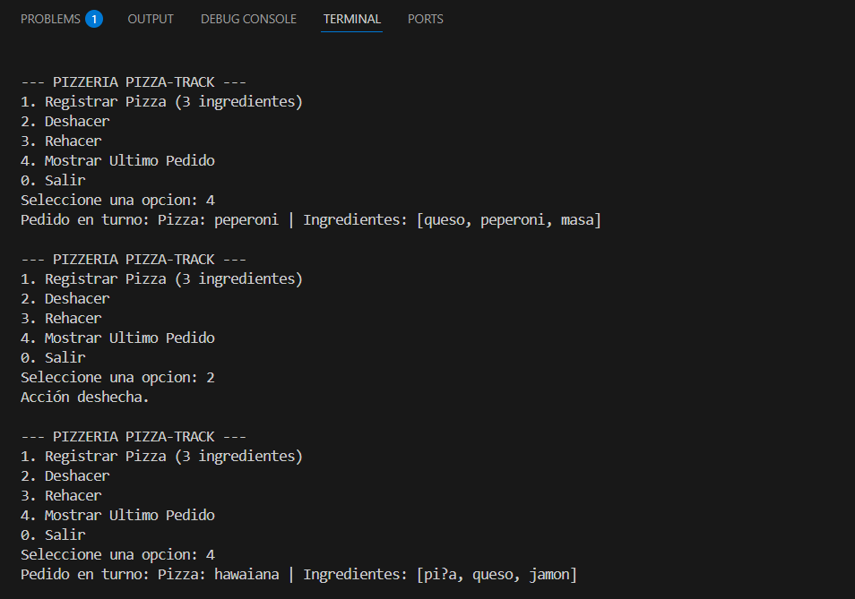
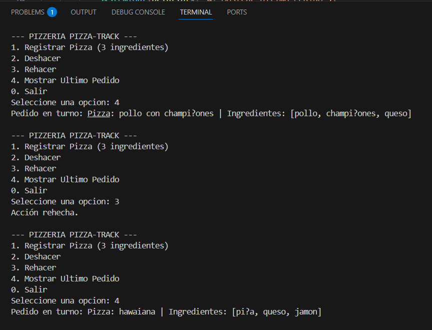

# Pizza-Track 🍕 - Sistema de Gestión de Pedidos

Proyecto desarrollado en Java para la gestión de pedidos de una pizzería utilizando estructuras de datos lineales (**Pilas**) implementadas manualmente mediante listas ligadas.

## 🚀 Funcionalidades
* **Registrar Pedido:** Guarda una pizza con un nombre y 3 ingredientes.
* **Deshacer (Undo):** Mueve la última pizza a una pila secundaria.
* **Rehacer (Redo):** Recupera la pizza de la pila secundaria.
* **Pedido Actual:** Permite visualizar la pizza que está en el tope.

## 📺 Sustentación
Puedes ver la explicación técnica y la prueba de ejecución aquí:
> **https://drive.google.com/file/d/1RcYHQ9fceRtH3-o8Xn7nTQh0iWThJcLO/view?usp=drive_link** 

## 📝 Instrucciones de Ejecución
1. Abrir la carpeta del proyecto en VS Code.
2. Asegurarse de tener instalado el "Extension Pack for Java".
3. Ejecutar la clase `Main.java`.

### Evidencia de funcionamiento

# Juan Daniel Duarte Moreno